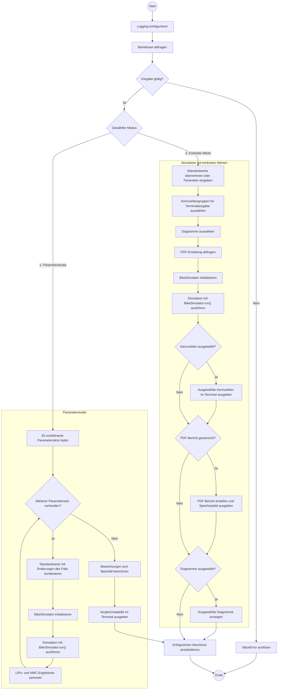
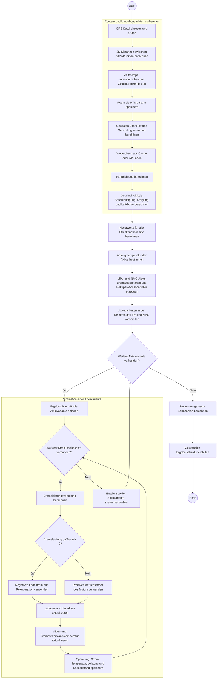

# E-Bike-Simulation

## 1. Einleitung

### 1.1 Ziel des Projekts

Ziel dieses Projekts ist die Entwicklung einer objektorientierten E-Bike-Simulation in Python. Das Programm untersucht anhand realer GPS-Daten, welche Kräfte, Leistungen und Energiemengen während einer Fahrt auftreten. Ein besonderer Schwerpunkt liegt auf dem Vergleich zweier Akkutypen: eines Lithium-Polymer-Akkus (LiPo) und eines Nickel-Mangan-Cobalt-Akkus (NMC).

Neben dem Energieverbrauch berücksichtigt die Simulation auch die Rückgewinnung von Bremsenergie durch Rekuperation. Dadurch kann untersucht werden, wie sich unterschiedliche Streckenabschnitte, Steigungen, Geschwindigkeiten und Fahrzeugparameter auf den Motor, die Akkus und das Bremssystem auswirken.

### 1.2 Kurze Beschreibung der Anwendung

Die Anwendung wird über ein Terminal-Menü bedient. Nach dem Programmstart kann zwischen einer Parameterstudie und einer einzelnen Simulation mit konkreten Eingabewerten gewählt werden.

Als Grundlage verwendet das Programm eine CSV-Datei mit GPS-Koordinaten, Zeitpunkten und Höhenwerten. Aus diesen Daten berechnet die Anwendung unter anderem:

- die Länge der einzelnen Streckenabschnitte,
- die Geschwindigkeit und Beschleunigung,
- die Steigung und das Höhenprofil,
- den Luft- und Rollwiderstand,
- die benötigte Motorleistung,
- den Stromverbrauch,
- den Ladezustand und die Temperatur der Akkus,
- die beim Bremsen zurückgewonnene Energie,
- die Belastung der Bremswiderstände und der mechanischen Bremsen.

Zusätzlich werden Wetter- und Ortsdaten über externe Schnittstellen abgerufen und zwischengespeichert. Die Simulation wird sowohl für den LiPo- als auch für den NMC-Akku durchgeführt, damit die Ergebnisse miteinander verglichen werden können.

Die Ergebnisse können im Terminal ausgegeben, als Diagramme dargestellt und in einem PDF-Bericht gespeichert werden. Außerdem erzeugt das Programm eine interaktive HTML-Karte der gefahrenen Route.

## 2. Projekt starten

### 2.1 Voraussetzungen

Zum Ausführen des Projekts werden Python 3.9 oder neuer sowie Git benötigt. Für das erstmalige Abrufen von Wetter- und Ortsdaten kann außerdem eine Internetverbindung erforderlich sein.

Die benötigten Python-Bibliotheken werden zentral in der Datei `requirements.txt` verwaltet.

### 2.2 Installation

Zuerst muss das Projekt von GitHub geklont werden. Dannach kann Optional kann eine virtuelle Python-Umgebung erstellt werden.
Anschließend müssen die benötigten Bibliotheken aus der Datei `requirements.txt` installiert:

```bash
python -m pip install -r requirements.txt
```

### 2.3 Starten des Programms

Das Programm wird im Projektordner mit folgendem Befehl gestartet:

```bash
python main.py
```

Nach dem Start erscheint das Terminal-Menü der E-Bike-Simulation.

## 3. Bedienung des Programms

### 3.1 Aufbau des Terminal-Menüs

Nach dem Programmstart erscheint folgende Auswahl:

```text
Möchtest du eine Parameterstudie durchführen oder
mit bestimmten Werten simulieren?

[1] Parameterstudie
[2] Konkrete Werte
Auswahl (1–2):
```

Die gewünschte Funktion wird durch Eingabe der entsprechenden Zahl und anschließendes Drücken der Eingabetaste ausgewählt.

### 2.4 API-Funktion testen

Wetter- und Ortsdaten werden zwischengespeichert, damit sie nicht bei jedem Programmstart erneut von den APIs abgerufen werden müssen. Die Cache-Dateien befinden sich im Ordner `data`:

```text
data/weather_cache.json
data/geocode_cache.json
```

Um zu überprüfen, ob die API-Abfragen funktionieren, können diese beiden Cache-Dateien vor dem Programmstart gelöscht werden. Beim nächsten Start ruft das Programm die benötigten Daten erneut ab und erstellt die Cache-Dateien automatisch neu.

Für diesen Test werden eine Internetverbindung sowie ein gültiger API-Zugang benötigt. Außerdem müssen mögliche Anfragelimits der verwendeten APIs beachtet werden.

### 3.2 Erklärung der Hauptmenüpunkte

#### Menüpunkt 1: Parameterstudie

Die Parameterstudie führt automatisch 20 vordefinierte Simulationen aus. Dazu gehören beispielsweise:

- eine Basiskonfiguration,
- ein Pendler-E-Bike,
- ein Lastenrad,
- ein sportliches Fahrrad,
- ein Mountainbike,
- verschiedene Fahrer- und Fahrradgewichte,
- unterschiedliche Luftwiderstände,
- verschiedene Reifentypen,
- unterschiedliche Motor- und Radkonfigurationen,
- ein Best-Case- und ein Worst-Case-Szenario.

Jede Konfiguration wird mit der Basiskonfiguration verglichen. Im Terminal wird dargestellt, wie stark der verbleibende Ladezustand von der Referenz abweicht. Dadurch lässt sich erkennen, welche Parameter den größten Einfluss auf den Energieverbrauch besitzen.

#### Menüpunkt 2: Konkrete Werte

Bei dieser Auswahl kann eine einzelne Simulation mit konkreten Parametern durchgeführt werden. Zunächst fragt das Programm, ob die Standardwerte verwendet werden sollen:

```text
Standardwerte für alle Parameter verwenden? [J/n]:
```

Wird die Eingabetaste gedrückt oder `j` eingegeben, verwendet das Programm folgende Standardwerte:

- Fahrergewicht: 70 kg
- Fahrradgewicht: 10 kg
- effektive Stirnfläche: 0,5625 m²
- Raddurchmesser: 27 Zoll
- Motorkonstante: 1,5 Nm/A
- Rollwiderstandsbeiwert: 0,0077

Bei der Eingabe von `n` können diese Werte einzeln verändert werden. Eine leere Eingabe übernimmt jeweils den angezeigten Standardwert. Dezimalzahlen können mit einem Punkt oder einem Komma eingegeben werden.

### 3.3 Auswahl der Terminalausgaben

Anschließend wird ausgewählt, welche Ergebnisse nach der Simulation im Terminal angezeigt werden sollen:

1. **Route und Fahrdaten:** Gesamtstrecke, Fahrzeit, Durchschnittsgeschwindigkeit, maximale Geschwindigkeit, Aufstieg und Abstieg.
2. **Umgebungsdaten:** Temperaturwerte und berechnete Luftdichte.
3. **Motor und Antrieb:** Rollwiderstand, Motorleistung, Motorstrom und benötigte mechanische Energie.
4. **Akkudaten:** Ladezustand, Spannung, Temperatur und Leistung des LiPo- und NMC-Akkus.
5. **Rekuperation und Bremsen:** zurückgewonnene Bremsenergie sowie Belastung der Bremswiderstände und mechanischen Bremsen.

Mehrere Menüpunkte können durch Kommas oder Leerzeichen getrennt eingegeben werden:

```text
1,3,4
```

Zusätzlich stehen folgende Eingaben zur Verfügung:

- `a` wählt alle Menüpunkte aus.
- `0` wählt keine Terminalausgabe aus.
- `q` bricht das Programm ab.

### 3.4 Auswahl der Diagramme

Danach können die gewünschten Diagramme ausgewählt werden. Folgende Darstellungen stehen zur Verfügung:

1. Geschwindigkeit
2. Beschleunigung
3. Steigung
4. Luftdichte
5. zurückgelegte Strecke
6. Windkraft
7. Antriebskraft
8. Motorleistung
9. Drehmoment
10. Motorstrom
11. Akkustrom
12. Batterieladezustand
13. Batteriespannung
14. Akkutemperatur
15. Akkuleistung
16. Akku-Innenwiderstand
17. Bremsleistungsbedarf
18. Rekuperationsleistung
19. Bremswiderstandsleistung
20. Bremswiderstandstemperatur
21. mechanische Bremsleistung

Auch hier können mehrere Nummern gemeinsam eingegeben werden. Mit `a` werden alle Diagramme ausgewählt. Mit `0` wird die Simulation ohne Diagrammausgabe fortgesetzt. Durch die Eingabe von `q` kann das Programm abgebrochen werden.

### 3.5 Erstellung des PDF-Berichts

Nach der Diagrammauswahl fragt das Programm, ob ein PDF-Bericht erstellt werden soll:

```text
Möchtest du aus dieser Auswahl einen PDF-Bericht erstellen? (j/n/q):
```

Folgende Eingaben sind möglich:

- `j` erstellt einen PDF-Bericht.
- `n` setzt die Simulation ohne PDF-Bericht fort.
- `q` bricht das Programm ab.

Der Bericht enthält die zuvor ausgewählten Kennzahlengruppen und Diagramme. Er wird unter folgendem Pfad gespeichert:

```text
outputs/ebike_simulation_report.pdf
```

Die gefahrene Route wird zusätzlich als interaktive Karte gespeichert:

```text
outputs/karte.html
```

### 3.6 Beispiel eines Programmablaufs

Ein möglicher Programmablauf sieht folgendermaßen aus:

1. Das Programm mit `python main.py` starten.
2. Menüpunkt 2 „Konkrete Werte“ auswählen.
3. Die Standardwerte mit `j` bestätigen.
4. Die Terminalausgaben 1, 4 und 5 auswählen.
5. Die Diagramme 1, 8, 12, 13, 14 und 18 auswählen.
6. Die PDF-Erstellung mit `j` bestätigen.

Anschließend liest das Programm die GPS-Daten ein, ergänzt Wetter- und Ortsinformationen und führt die Simulation für beide Akkutypen aus. Danach werden die gewählten Kennzahlen im Terminal ausgegeben, der PDF-Bericht und die Karte gespeichert sowie die ausgewählten Diagramme angezeigt.

### 3.7 Eingaben und Ausgaben

Die wichtigste Eingabedatei ist:

```text
data/final_project_input_data.csv
```

Sie enthält die GPS- und Streckendaten, die für die Berechnungen benötigt werden. Weitere Eingaben erfolgen über das Terminal. Dazu gehören beispielsweise das Fahrergewicht, das Fahrradgewicht und der Rollwiderstandsbeiwert.

Die Anwendung erzeugt folgende Ausgaben:

- Status- und Fehlermeldungen im Terminal,
- ausgewählte Simulationsergebnisse im Terminal,
- eine Vergleichstabelle bei der Parameterstudie,
- grafische Diagramme,
- einen optionalen PDF-Bericht,
- eine interaktive HTML-Karte der Route,
- Cache-Dateien für bereits abgerufene Wetter- und Ortsdaten.

## 4. Softwarearchitektur

### 4.1 UML-Klassendiagramm

Das folgende UML-Klassendiagramm zeigt die wichtigsten Klassen der Anwendung sowie deren Vererbungs- und Nutzungsbeziehungen. Zur besseren Übersicht werden nur zentrale Attribute und Methoden dargestellt.

```mermaid
classDiagram
    direction TB

    namespace Simulation {
        class BikeSimulator {
            -gps_file
            -battery_capacity_ah
            -initial_soc
            -rider_mass_kg
            -bike_mass_kg
            -drag_area_m2
            -wheel_diameter_inch
            -motor_constant_nm_per_a
            -rolling_resistance_coefficient
            -_validate_parameters()
            -_prepare_route_data()
            -_calculate_motor_data()
            -_create_simulation_components()
            -_simulate_battery_variant()
            -_calculate_metrics()
            -_build_results()
            +run()
        }
    }

    namespace Streckenverarbeitung {
        class GPSReader {
            -df
            -distances
            -total_3d
            -climb
            -descent
            +load_file(file_path)
            +calculate_distances()
            +get_stats()
            +haversine(lat1, lon1, lat2, lon2)
        }

        class RouteCalculator {
            +calculate_speed(timedeltas, distances)
            +calculate_acceleration(timedeltas, speeds)
            +calculate_slope(distances, elevations)
        }

        class MovementDirection {
            -df
            -lat
            -lon
            -_bearing(lat1, lon1, lat2, lon2)
            +calculate()
        }

        class GPSMap {
            -points
            -line_color
            -tiles
            +add_points(lat, lon)
            +clear()
            -_construct_map()
            +save()
        }

        class Cleaner {
            +clean_places(places, values, min_size)
        }
    }

    namespace Datenanreicherung {
        class TripWeather {
            -df
            -_key(latitude, longitude, time)
            -_fetch(cells)
            +get_weather()
        }

        class Reverse_Geocoder {
            -df
            -api_key
            +geoapify_bulk(coordinates)
            +get_results()
        }
    }

    namespace Antriebssystem {
        class Motor {
            -total_mass_kg
            -drag_area_m2
            -wheel_radius_m
            -motor_constant_nm_per_a
            -rolling_resistance_coefficient
            +calculate(speeds, accelerations, slopes, air_density)
        }
    }

    namespace Akkusystem {
        class BatteryBase {
            <<abstract>>
            +apply_current(current, duration)
            +voltage(current)
        }

        class BatteryPack {
            -capacity_nom_ah
            -soc
            -temperature_c
            -internal_resistance
            -Vmin
            -Vmax
            +effective_internal_resistance()
            +update_temperature()
            +maximum_charge_current(duration)
            +apply_current(current, duration)
            +voltage(current)
            +is_empty()
            +is_full()
        }

        class LiPoBatteryPack {
            +voltage(current)
        }

        class NMCBatteryPack {
            +voltage(current)
        }

        class RegenerativeBrakingController {
            -efficiency
            -max_electrical_power_w
            +calculate_charge_current(battery, requested_power)
            +distribute(braking_power, duration, battery, brake_resistor)
        }

        class BrakeResistor {
            -resistance_ohm
            -max_power_w
            -temperature_c
            -dissipated_energy_j
            +maximum_power(dc_voltage)
            +update_temperature(power, duration, ambient_temperature)
            +dissipated_energy_wh()
        }
    }

    BatteryPack --|> BatteryBase
    LiPoBatteryPack --|> BatteryPack
    NMCBatteryPack --|> BatteryPack

    BikeSimulator ..> GPSReader : liest GPS-Daten
    BikeSimulator ..> RouteCalculator : berechnet Fahrdaten
    BikeSimulator ..> MovementDirection : berechnet Fahrtrichtung
    BikeSimulator ..> GPSMap : erstellt Streckenkarte
    BikeSimulator ..> Cleaner : bereinigt Ortsdaten
    BikeSimulator ..> TripWeather : lädt Wetterdaten
    BikeSimulator ..> Reverse_Geocoder : lädt Ortsdaten
    BikeSimulator ..> Motor : berechnet Antriebsdaten
    BikeSimulator ..> LiPoBatteryPack : erzeugt und simuliert
    BikeSimulator ..> NMCBatteryPack : erzeugt und simuliert
    BikeSimulator ..> RegenerativeBrakingController : steuert Rekuperation
    BikeSimulator ..> BrakeResistor : erzeugt und simuliert

    RegenerativeBrakingController ..> BatteryPack : begrenzt Ladestrom
    RegenerativeBrakingController ..> BrakeResistor : verteilt Bremsleistung
    GPSMap ..> GPSReader : berechnet Start-Ziel-Distanz
```



### 4.2 Erklärung der Architektur

Die Anwendung besitzt eine modulare und überwiegend objektorientierte Architektur. Die einzelnen Aufgaben des Programms sind auf mehrere Klassen und Module verteilt. Dadurch können die Bestandteile unabhängig voneinander entwickelt, getestet und erweitert werden.

Die Architektur lässt sich in fünf Bereiche unterteilen:

1. **Programmsteuerung:**  
   Das Modul `main.py` stellt das Terminal-Menü bereit, verarbeitet die Benutzereingaben und startet die gewünschte Simulation.

2. **Simulationssteuerung:**  
   Die Klasse `BikeSimulator` bildet den zentralen Bestandteil der Anwendung. Sie koordiniert das Einlesen und Aufbereiten der Streckendaten, die Motorberechnung, die Akkusimulation und die Zusammenfassung der Ergebnisse.

3. **Datenverarbeitung:**  
   Klassen wie `GPSReader`, `RouteCalculator`, `MovementDirection`, `TripWeather` und `Reverse_Geocoder` lesen die Eingangsdaten ein und ergänzen beziehungsweise berechnen die benötigten Strecken- und Umgebungsinformationen.

4. **Physikalische Simulation:**  
   Die Klassen `Motor`, `BatteryPack`, `LiPoBatteryPack`, `NMCBatteryPack`, `RegenerativeBrakingController` und `BrakeResistor` bilden die physikalischen Eigenschaften des E-Bikes ab.

5. **Ausgabe und Berichterstellung:**  
   Die Module `plotter.py`, `reporting/console.py` und `reporting/pdf_report.py` bereiten die Ergebnisse für das Terminal, die Diagramme und den PDF-Bericht auf.

Die Klassen tauschen ihre Ergebnisse hauptsächlich über Dictionaries, Pandas-DataFrames und NumPy-Arrays aus. Dadurch können größere Mengen von Strecken- und Simulationsdaten gemeinsam verarbeitet werden.

### 4.3 Beziehungen zwischen den Klassen

#### Zentrale Simulationssteuerung

Die Klasse `BikeSimulator` ist die zentrale Steuerung der Simulation. Sie erzeugt oder verwendet die benötigten Hilfs- und Modellklassen und führt deren Ergebnisse zusammen.

Dabei bestehen unter anderem folgende Beziehungen:

- `BikeSimulator` verwendet `GPSReader`, um die GPS-Datei einzulesen und Streckendistanzen zu berechnen.
- `BikeSimulator` verwendet `RouteCalculator`, um Geschwindigkeit, Beschleunigung und Steigung zu bestimmen.
- `BikeSimulator` verwendet `MovementDirection`, um die Fahrtrichtung zwischen den GPS-Punkten zu berechnen.
- `BikeSimulator` verwendet `TripWeather`, um Wetterdaten abzurufen oder aus dem Cache zu laden.
- `BikeSimulator` verwendet `Reverse_Geocoder`, um den GPS-Koordinaten Ortsnamen zuzuordnen.
- `BikeSimulator` verwendet `Cleaner`, um kurze oder fehlerhafte Wechsel zwischen Ortsnamen zu bereinigen.
- `BikeSimulator` verwendet `GPSMap`, um eine interaktive Karte der gefahrenen Strecke zu erstellen.
- `BikeSimulator` erzeugt ein `Motor`-Objekt zur Berechnung von Kräften, Leistungen, Drehmomenten und Strömen.
- `BikeSimulator` erzeugt jeweils ein `LiPoBatteryPack` und ein `NMCBatteryPack`.
- `BikeSimulator` erzeugt den `RegenerativeBrakingController` und zwei unabhängige `BrakeResistor`-Objekte.

#### Vererbung im Akkusystem

Die abstrakte Klasse `BatteryBase` legt die gemeinsame Schnittstelle der Akkumodelle fest. Sie definiert, dass jedes Akkumodell Methoden zum Anwenden eines Stroms und zum Berechnen der Spannung bereitstellen muss.

`BatteryPack` erbt von `BatteryBase` und stellt das gemeinsame elektrische und thermische Akkumodell bereit. Dazu gehören unter anderem der Ladezustand, der Innenwiderstand, die Temperatur und die zulässigen Lade- und Entladeströme.

`LiPoBatteryPack` und `NMCBatteryPack` erben wiederum von `BatteryPack`. Beide Klassen verwenden das gemeinsame Akkumodell, überschreiben jedoch die Methode `voltage()`. Dadurch können für die beiden Akkutypen unterschiedliche Spannungskennlinien verwendet werden.

#### Rekuperation und Bremssystem

Der `RegenerativeBrakingController` arbeitet mit einem `BatteryPack` und einem `BrakeResistor` zusammen. Die verfügbare Bremsleistung wird in folgender Reihenfolge verteilt:

1. Ein Teil der Bremsleistung wird zum Laden des Akkus verwendet.
2. Nicht vom Akku aufnehmbare elektrische Leistung wird an den Bremswiderstand weitergegeben.
3. Die verbleibende Bremsleistung wird von der mechanischen Bremse übernommen.

Die Berechnung wird für den LiPo- und den NMC-Akku getrennt durchgeführt. Beide Varianten besitzen einen eigenen Bremswiderstand, damit auch deren Temperaturentwicklung unabhängig simuliert werden kann.

### 4.4 Beschreibung der Module

| Modul | Aufgabe |
|---|---|
| `main.py` | Enthält das Terminal-Menü, verarbeitet Eingaben und startet die Parameterstudie oder eine einzelne Simulation. |
| `src/bikesimulator.py` | Koordiniert den vollständigen Ablauf der E-Bike-Simulation und führt alle Teilergebnisse zusammen. |
| `src/gps_reader.py` | Liest die GPS-Datei ein, überprüft die enthaltenen Daten und berechnet die Streckendistanzen sowie Auf- und Abstieg. |
| `src/route_calculator.py` | Berechnet Geschwindigkeit, Beschleunigung und Steigung aus den GPS- und Zeitdaten. |
| `src/get_driving_direction.py` | Berechnet die Fahrtrichtung zwischen aufeinanderfolgenden GPS-Punkten. |
| `src/get_weather_data.py` | Ruft Wetterdaten über die Open-Meteo-API ab und speichert sie in einer Cache-Datei. |
| `src/reverse_geocoding.py` | Ordnet GPS-Koordinaten über die Geoapify-API Ortsinformationen zu und verwendet dafür einen Cache. |
| `src/data_cleaner.py` | Bereinigt die Ortsdaten und entfernt sehr kurze oder uneinheitliche Ortswechsel. |
| `src/gps_plot_route_on_map.py` | Erstellt mit Folium eine interaktive HTML-Karte der gefahrenen Strecke. |
| `src/air_density.py` | Berechnet die Luftdichte aus Temperatur und Höhe. |
| `src/motor.py` | Berechnet die Kräfte, Leistungen, Drehmomente und Ströme des E-Bike-Motors. |
| `src/battery_base.py` | Definiert die abstrakte Basisschnittstelle für die Akkumodelle. |
| `src/battery_pack.py` | Enthält das gemeinsame elektrische und thermische Modell eines Akkupacks. |
| `src/lipo_battery.py` | Erweitert das allgemeine Akkumodell um die Spannungskennlinie eines LiPo-Akkus. |
| `src/nmc_battery.py` | Erweitert das allgemeine Akkumodell um die Spannungskennlinie eines NMC-Akkus. |
| `src/regenerative_braking.py` | Verteilt die Bremsleistung auf Akku, Bremswiderstand und mechanische Bremse. |
| `src/brake_resistor.py` | Modelliert die elektrische Belastung und Temperaturentwicklung eines Bremswiderstands. |
| `src/plotter.py` | Erstellt und zeigt die auswählbaren Diagramme der Simulationsergebnisse an. |
| `src/reporting/console.py` | Formatiert Kennzahlen und gibt die ausgewählten Ergebnisse im Terminal aus. |
| `src/reporting/pdf_report.py` | Erstellt aus den ausgewählten Kennzahlen und Diagrammen einen PDF-Bericht. |
| `src/__init__.py` | Kennzeichnet den Ordner `src` als Python-Paket. |
| `src/reporting/__init__.py` | Kennzeichnet den Ordner `reporting` als Unterpaket. |
| `tests/` | Enthält automatisierte Tests für zentrale Berechnungen und Simulationskomponenten. |

### 4.5 Aufgaben der Klassen und wichtige Methoden

In der folgenden Übersicht werden nun die wichtigsten Methoden beschrieben. 

| Klasse | Aufgabe | Wichtige Methoden |
|---|---|---|
| `BikeSimulator` | Steuert die vollständige Simulation und führt alle Teilberechnungen zusammen. | `run()` startet die Simulation. `_prepare_route_data()` bereitet Strecken- und Umgebungsdaten vor. `_calculate_motor_data()` berechnet die Motorwerte. `_simulate_battery_variant()` simuliert eine Akkuvariante. |
| `GPSReader` | Liest und überprüft die GPS-Daten. | `load_file()` lädt die CSV-Datei. `calculate_distances()` berechnet die räumlichen Distanzen. `get_stats()` liefert zusammengefasste Streckenwerte. |
| `RouteCalculator` | Berechnet Fahrdaten aus Strecke und Zeit. | `calculate_speed()` berechnet die Geschwindigkeit. `calculate_acceleration()` bestimmt und filtert die Beschleunigung. `calculate_slope()` berechnet die Steigung. |
| `MovementDirection` | Bestimmt die Fahrtrichtung des E-Bikes. | `calculate()` ergänzt die GPS-Daten um den Kurswinkel. |
| `GPSMap` | Erstellt eine interaktive Streckenkarte. | `save()` erzeugt die Karte und speichert sie als HTML-Datei. |
| `Cleaner` | Bereinigt die durch Reverse Geocoding ermittelten Ortsnamen. | `clean_places()` fasst kurze Ortsabschnitte zusammen und vereinheitlicht bekannte Ortsbezeichnungen. |
| `TripWeather` | Lädt Wetterdaten und verwaltet den Wetter-Cache. | `get_weather()` liefert die Wetterdaten und ruft nur fehlende Werte über die API ab. |
| `Reverse_Geocoder` | Ermittelt Ortsinformationen zu GPS-Koordinaten. | `get_results()` lädt Ortsdaten aus dem Cache oder über die API. `geoapify_bulk()` führt die API-Abfrage für mehrere Koordinaten aus. |
| `Motor` | Modelliert die während der Fahrt wirkenden Kräfte und den Motorbedarf. | `calculate()` berechnet Antriebskraft, Windkraft, Rollwiderstand, Motorleistung, Drehmoment und Motorstrom. |
| `BatteryBase` | Definiert die gemeinsame Schnittstelle der Akkumodelle. | `apply_current()` und `voltage()` sind abstrakte Methoden, die von den Unterklassen umgesetzt werden müssen. |
| `BatteryPack` | Stellt das gemeinsame elektrische und thermische Akkumodell bereit. | `apply_current()` aktualisiert den Ladezustand. `voltage()` berechnet die Klemmenspannung. `maximum_charge_current()` bestimmt den zulässigen Ladestrom. `update_temperature()` aktualisiert die Akkutemperatur. |
| `LiPoBatteryPack` | Modelliert die Spannungskennlinie des LiPo-Akkus. | `voltage()` berechnet die LiPo-spezifische Spannung abhängig von Ladezustand, Strom und Innenwiderstand. |
| `NMCBatteryPack` | Modelliert die Spannungskennlinie des NMC-Akkus. | `voltage()` berechnet die NMC-spezifische Spannung abhängig von Ladezustand, Strom und Innenwiderstand. |
| `RegenerativeBrakingController` | Verteilt die beim Bremsen auftretende Leistung. | `calculate_charge_current()` bestimmt den möglichen Ladestrom. `distribute()` verteilt die Leistung auf Akku, Bremswiderstand und mechanische Bremse. |
| `BrakeResistor` | Nimmt überschüssige elektrische Bremsleistung auf und wandelt sie in Wärme um. | `maximum_power()` bestimmt die aufnehmbare Leistung. `update_temperature()` aktualisiert Temperatur und Energie. `dissipated_energy_wh` liefert die umgewandelte Energie. |

### 4.6 Wichtige Funktionen außerhalb der Klassen

Einige Bestandteile der Anwendung sind als Funktionen und nicht als Klassen umgesetzt:

| Funktion | Aufgabe |
|---|---|
| `main()` | Startet das Terminal-Menü und steuert den vom Benutzer gewählten Programmablauf. |
| `run_study()` | Führt die Parameterstudie mit den vordefinierten Simulationsfällen aus. |
| `calculate_air_density()` | Berechnet die Luftdichte für alle Streckenabschnitte. |
| `create_result_figure()` | Erstellt ein ausgewähltes Ergebnisdiagramm. |
| `show_result_figures()` | Zeigt die ausgewählten Diagramme nacheinander an. |
| `format_selected_metrics()` | Bereitet die ausgewählten Kennzahlen für Terminal und PDF auf. |
| `print_selected_metrics()` | Gibt die ausgewählten Kennzahlen im Terminal aus. |
| `create_pdf_report()` | Erstellt den vollständigen PDF-Bericht. |

## 5. Programmablauf

### 5.1 Aktivitätsdiagramme

Die folgenden Aktivitätsdiagramme stellen den Programmablauf dar. Das erste Diagramm zeigt die Steuerung durch `main.py`. Das zweite Diagramm beschreibt den internen Ablauf der Methode `BikeSimulator.run()`.

#### 5.1.1 Gesamtablauf des Programms



#### 5.1.2 Ablauf der Simulation



Die beiden Akkuvarianten werden fachlich unabhängig voneinander simuliert. Im Programm werden sie nicht parallel ausgeführt. Zuerst wird die vollständige Strecke mit dem LiPo-Akku und anschließend mit dem NMC-Akku simuliert. Beide Varianten verwenden dieselben Routen- und Motorwerte, besitzen aber jeweils einen eigenen Akkuzustand und einen eigenen Bremswiderstand.

### 5.2 Erklärung des Programmablaufs

Der Programmablauf beginnt in der Funktion `main()`. Der Benutzer entscheidet, ob eine Parameterstudie oder eine einzelne Simulation mit konkreten Werten durchgeführt werden soll.

Bei der Parameterstudie werden 20 vordefinierte Parametersätze nacheinander verarbeitet. Jeder Parametersatz verändert bestimmte Werte der Basiskonfiguration, beispielsweise das Fahrergewicht, das Fahrradgewicht, die Stirnfläche oder den Rollwiderstandsbeiwert. Für jeden Fall wird ein neues `BikeSimulator`-Objekt erzeugt und eine vollständige Simulation ausgeführt. Nach Abschluss aller Fälle werden die Ergebnisse mit der Basiskonfiguration verglichen und im Terminal ausgegeben.

Bei einer Simulation mit konkreten Werten kann der Benutzer entweder die Standardwerte übernehmen oder eigene Parameter eingeben. Danach wird festgelegt, welche Kennzahlengruppen im Terminal ausgegeben, welche Diagramme angezeigt und ob ein PDF-Bericht erstellt werden sollen.

Unabhängig vom ausgewählten Modus wird die eigentliche Berechnung durch die Methode `BikeSimulator.run()` durchgeführt. Die Methode koordiniert die Datenaufbereitung, die Motorberechnung, die Akkusimulation und die Zusammenfassung der Ergebnisse.

### 5.3 Verarbeitung der Eingaben

Die Anwendung verarbeitet drei Arten von Eingaben:

#### Eingaben über das Terminal

Die erste Eingabe bestimmt den Betriebsmodus:

- `1` startet die Parameterstudie.
- `2` startet eine Simulation mit konkreten Werten.

Bei der Einzelsimulation können die Standardwerte übernommen oder folgende Parameter einzeln eingegeben werden:

- Fahrergewicht
- Fahrradgewicht
- effektive Stirnfläche
- Raddurchmesser
- Motorkonstante
- Rollwiderstandsbeiwert

Eine leere Eingabe übernimmt den jeweiligen Standardwert. Bei Dezimalzahlen werden sowohl ein Punkt als auch ein Komma akzeptiert. Das Komma wird vor der Umwandlung durch einen Punkt ersetzt.

Die eingegebenen Werte werden in Fließkommazahlen umgewandelt und auf Gültigkeit geprüft. Nicht numerische oder nicht positive Werte führen zu einem `ValueError`.

Bei der Auswahl von Kennzahlen und Diagrammen können mehrere Nummern durch Kommas oder Leerzeichen getrennt eingegeben werden. Außerdem sind folgende Eingaben möglich:

- `a` wählt alle Einträge aus.
- `0` wählt keine Einträge aus.
- `q` bricht das Programm ab.

Doppelte Auswahlen werden entfernt. Zahlen außerhalb des gültigen Bereichs und andere ungültige Eingaben werden abgelehnt.

#### Eingaben aus der GPS-Datei

Die GPS-Daten werden aus folgender Datei gelesen:

```text
data/final_project_input_data.csv
```

Die Datei muss mindestens folgende Spalten enthalten:

- `lat` für den Breitengrad,
- `lon` für den Längengrad,
- `ele` für die Höhe,
- `time` für den Zeitstempel,
- `temperature` für die Temperatur.

Beim Einlesen wird geprüft, ob die Datei vorhanden und nicht leer ist. Zusätzlich müssen alle benötigten Spalten vorhanden sein und gültige Werte enthalten. Für die Berechnung einer Strecke werden mindestens zwei GPS-Punkte benötigt.

#### Eingaben über externe APIs

Wetter- und Ortsinformationen werden aus Cache-Dateien geladen. Sind die benötigten Daten dort noch nicht vorhanden, führt das Programm eine Anfrage an die jeweilige API aus.

Die Wetterdaten werden über Open-Meteo und die Ortsinformationen über Geoapify abgerufen. Anschließend werden die Ergebnisse in den Cache-Dateien gespeichert, damit sie bei späteren Simulationen nicht erneut heruntergeladen werden müssen.

### 5.4 Ablauf einer vollständigen Simulation

Eine vollständige Simulation läuft in folgenden Schritten ab:

1. **Simulationsparameter prüfen:**  
   Beim Erzeugen des `BikeSimulator` werden Akkukapazität, Ladezustand, Filtergröße und weitere Simulationsparameter überprüft.

2. **GPS-Datei einlesen:**  
   Der `GPSReader` liest die CSV-Datei ein und kontrolliert die benötigten Spalten und Werte.

3. **Streckendaten berechnen:**  
   Aus den GPS-Koordinaten und Höhenwerten werden die räumlichen Distanzen sowie der Auf- und Abstieg berechnet. Aus den Zeitstempeln entstehen die Zeitdifferenzen der einzelnen Streckenabschnitte.

4. **Streckeninformationen ergänzen:**  
   Das Programm erstellt eine HTML-Karte, ruft Orts- und Wetterinformationen ab und berechnet die Fahrtrichtung.

5. **Fahrwerte bestimmen:**  
   Der `RouteCalculator` berechnet Geschwindigkeit, Beschleunigung und Steigung. Zusätzlich wird für jeden Streckenabschnitt die Luftdichte bestimmt.

6. **Motorwerte berechnen:**  
   Der `Motor` berechnet die Beschleunigungs-, Steigungs-, Roll- und Luftwiderstandskräfte. Daraus werden die Motorleistung, das Drehmoment, der Motorstrom und die erforderliche Bremsleistung bestimmt.

7. **Simulationskomponenten erzeugen:**  
   Es werden ein LiPo-Akku, ein NMC-Akku, zwei Bremswiderstände und ein Rekuperationscontroller erzeugt.

8. **LiPo-Akku simulieren:**  
   Die vollständige Strecke wird Abschnitt für Abschnitt mit dem LiPo-Akku simuliert.

9. **NMC-Akku simulieren:**  
   Anschließend wird dieselbe Strecke mit denselben Motorwerten für den NMC-Akku simuliert.

10. **Streckenabschnitte verarbeiten:**  
    Für jeden Abschnitt wird entschieden, ob Antriebs- oder Bremsleistung benötigt wird. Im Antriebsfall wird der Akku entladen. Im Bremsfall wird die verfügbare Energie auf Akku, Bremswiderstand und mechanische Bremse verteilt.

11. **Zustände aktualisieren:**  
    Nach jedem Abschnitt werden Ladezustand, Spannung, Innenwiderstand und Temperatur des Akkus sowie die Temperatur des Bremswiderstands aktualisiert.

12. **Ergebnisse zusammenfassen:**  
    Nach beiden Akkusimulationen werden Kennzahlen wie Gesamtstrecke, Energieverbrauch, Endladezustand, Temperaturen und zurückgewonnene Bremsenergie berechnet.

13. **Ergebnisse ausgeben:**  
    `main.py` gibt die ausgewählten Kennzahlen im Terminal aus. Optional werden ein PDF-Bericht und die ausgewählten Diagramme erstellt.

Falls der Benutzer das Programm mit `q` abbricht, wird eine `UserCancelledError` ausgelöst und das Programm kontrolliert beendet. Datei-, Eingabe- und unerwartete Programmfehler werden abgefangen und über das Logging ausgegeben.

## 6. Fehlerbehandlung und Tests

### 6.1 Fehlerbehandlung

Die Anwendung überprüft sowohl die Benutzereingaben als auch die eingelesenen und berechneten Simulationsdaten. Ungültige Werte werden frühzeitig erkannt und führen zu einer verständlichen Fehlermeldung.

Behandelt werden unter anderem:

- fehlende oder fehlerhafte GPS-Dateien,
- ungültige Zahlen und Simulationsparameter,
- fehlende Spalten oder Werte in der CSV-Datei,
- unzulässige Akku-, Motor- und Temperaturwerte,
- Fehler beim Zugriff auf externe APIs,
- ein Abbruch durch den Benutzer mit `q` oder `Strg + C`,
- unerwartete Programmfehler.

Status-, Warn- und Fehlermeldungen werden mit dem Python-Modul `logging` im Terminal ausgegeben. Dadurch lässt sich nachvollziehen, welcher Programmschritt gerade ausgeführt wird und an welcher Stelle ein Fehler aufgetreten ist.

### 6.2 Automatisierte Tests

Für zentrale Bestandteile der Simulation wurden automatisierte Unit-Tests mit dem Python-Modul `unittest` erstellt.

Die Tests überprüfen unter anderem:

- die Berechnung von Geschwindigkeit, Beschleunigung und Steigung,
- die Berechnung der Luftdichte,
- die Antriebs- und Bremsleistung des Motors,
- das Laden und Entladen des Akkus,
- die Begrenzung des maximalen Ladestroms,
- die Verteilung der Rekuperationsleistung,
- die Leistungsbilanz zwischen Akku, Bremswiderstand und mechanischer Bremse,
- die Behandlung ungültiger Eingabewerte.

Die Tests können im Projektordner mit folgendem Befehl ausgeführt werden:

```bash
python -m unittest discover -s tests
```

Durch die automatisierten Tests können Änderungen am Programm überprüft werden, ohne jede Berechnung manuell kontrollieren zu müssen.

## 8. Verwendung von KI

Bei der Entwicklung dieses Projekts wurden die KI-Werkzeuge Claude, OpenAI Codex und GitHub Copilot unterstützend eingesetzt.

Die KI-Werkzeuge wurden für folgende Aufgaben verwendet:

- Unterstützung bei der Fehlersuche,
- Strukturierung des Programmcodes und der Module,
- Entwicklung und Überarbeitung der Rekuperationslogik,
- Unterstützung bei der Implementierung des Terminal-Menüs,
- Verbesserung und Strukturierung der Projektdokumentation,

Die grundlegenden Anforderungen, die fachlichen Entscheidungen und der Aufbau der Simulation wurden selbst festgelegt. Die vorgeschlagenen Lösungen wurden nicht ungeprüft übernommen, sondern in den bestehenden Programmcode integriert, getestet und bei Bedarf angepasst.
